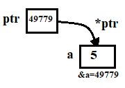
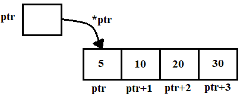
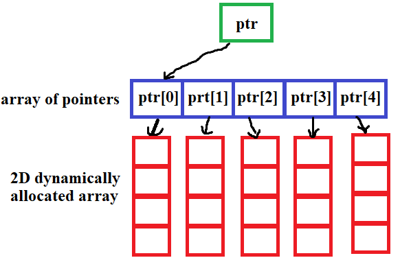

## Objectives:
- Working Memory and Pointers
- Working with Dynamic Size Array
- Working with Enum, Structs and Typedef
## Memory and Pointers :
### Introduction :
Memory is the place where our computer store all data and variables that the programs use as grid each column has it own address and inside it we can see the value we stored, C++ is powerfull cuz it let use access the memory and manipulate the values inside those grids
to access and display memory address of any variable in C++ we use & before the variable name
```
#include <stdio.h>

int main(){
    int A = 5;
    printf("A have the value %d and the adress %d \n", A, &A);
    return 0;
}
```
### Pointers :
Pointers are special variables that store the memory addresses of other variables. This allows us to indirectly manipulate the data stored at those addresses,to create a pointer in languages like C++ or C, you specify the data type of the variable you want to point to and then prefix the pointer variable name with an asterisk (\*).
```
int *p1; // this pointer for integers
```
after creating pointer we can assign a memory address and make it point to this case in memory like that
```
#include <iostream>
using namespace std;

int main(){
	int a = 2;
	int* p1 = &a;
	cout << "The memory address of a is " << p1;
    return 0;
}


```
to access the value of the memory case that the pointer point to we use \* before the pointer name  
  
```
#include <iostream>
using namespace std;

int main(){
	int a = 2;
	int *p1 = &a;
	cout << "The memory address " << p1 << " store this value " << *p1;
    return 0;
}
```
We can change the data in the case where the pointer is pointing by using ``*p1 = value``
```
#include <iostream>
using namespace std;

int main(){
	int a = 2;
	int *p1 = &a;
	cout << "the value of a is " << a << endl;
	*p1 = 10;
	cout << "the value of a changed to " << a << endl;
    return 0;
}

```

### Dynamic Memory Allocation :

When we declare a variable, the compiler reserves a specific memory location to store its value. We can obtain the address of this memory location using a pointer.  
However, pointers offer more than just accessing variable addresses. They enable dynamic memory allocation, which allows us to reserve memory space during program execution rather than having it fixed at compile time.  
- The `new` keyword allocates a block of memory of the specified size and returns a pointer to the beginning of that block.
- After the `new` keyword, we specify the data type.

After successfully allocating memory using `new`, we can use the allocated space just like we would use any other variable of the same data type.

#### Example :
```
#include <iostream>
using namespace std;

int main(){
	int *p1 = new int;
	*p1 = 5;
	cout << "the value that p1 hold is " << *p1;
    return 0;
}
```

### Memory Deallocation :
After we finish using a block of memory that we have dynamically allocated (for example, using the `new` keyword), it is essential to release it back to the system.  
Failing to do so leads to a **memory leak**. A memory leak occurs when a program allocates memory but never releases it, gradually consuming more and more of the available memory. This can eventually cause the program to crash or the system to run out of memory for other applications.  
To prevent memory leaks, use the **`delete` keyword** to release the allocated memory when we are finished with it.
#### Example :
```
#include <iostream>
using namespace std;

int main(){
	int *p1 = new int;
	*p1 = 5;
	cout << "the value that p1 hold is " << *p1;
	delete p1;
    return 0;
}
```
#### Remarque :
We can add `()` after the variable type when using `new` to allocate memory and initialize all its contents to zero.
```
#include <iostream>
using namespace std;

int main(){
	int *p1 = new int();
	*p1 = 5;
	cout << "the value that p1 hold is " << *p1;
	delete p1;
    return 0;
}
```
## Dynamic Size Array :
### Introduction :

Arrays are variables that can store multiple values of the same data type. These values are stored consecutively in memory, however, a significant limitation of arrays is their fixed size, to overcome this limitation, we can utilize pointers and dynamic memory allocation to create dynamically sized arrays
**To create a dynamically sized array:**
1. **Declare a pointer** to the desired data type.
2. **Allocate initial memory** for the array using `new`.
3. **To resize the array**, we just need to:
    - Copy the existing array data to a new memory location.
    - Allocate the requested amount of memory for the resized array.
    - Optionally, free the original memory block.

This approach provides flexibility by allowing the array to grow or shrink as needed during program execution.  
When we're finished using the array, we should release the memory it's using. This prevents memory leaks and helps our program run smoothly. We do this by using the `delete` function.
#### Example :
```
#include <iostream>
using namespace std;

int main(){
	int *p1 = new int[5];
	*(p1) = 1;
	*(p1+1) = 5;
	*(p1+2) = 8;
	*(p1+3) = 9;
	*(p1+4) = 10;
	for(int i = 0; i<5 ; i++){
		cout << "the value in position " << i << "  is " << *(p1 + i) << endl;
	}
	delete[] p1;
    return 0;
}
```
To access the first value in a dynamic array, we use the pointer itself (e.g., `*p1`) because the pointer always points to the beginning of the array.  
To access subsequent values, we increment the pointer. This moves the pointer to the next memory address, allowing us to access the next element in the array. We repeat this process to access all the elements.  

#### Example :
```
#include <iostream>
using namespace std;

int main(){
	int *p1 = new int[5];
	int *tmp;
	*(p1) = 1;
	*(p1+1) = 2;
	*(p1+2) = 3;
	*(p1+3) = 4;
	*(p1+4) = 5;
	tmp = new int[10];
	for(int i = 0; i < 5; i++){
	  *(tmp + i)  = *(p1 + i)  ;
	}
	delete[] p1;
	p1 = tmp;
	*(p1+5) = 6;
	*(p1+6) = 7;
	*(p1+7) = 8;
	*(p1+8) = 9;
	*(p1+9) = 10;
	for(int i = 0; i < 10; i++){
		cout << "the value in position " << i << " is "<< *(p1 + i)<<endl;
	}
	delete[] p1;
    return 0;
}
```
### Strings :
Strings are essentially arrays of characters. A key characteristic of strings is that they always end with the null character ``'\0'``.  
To create dynamically sized strings, we use a character pointer ``char *``.
#### Example : 
```
#include <iostream>
using namespace std;

int main(){
	char *name = new char[4];
	*(name) = 'A';
	*(name+1) = 'l';
	*(name+2) = 'i';
	*(name+3) = '\0';
	cout << "my name is " << name << endl;
	delete[] name;
    return 0;
}
```
The last character in a string is always the null character ('\0'). This null character signals the end of the string to the compiler.  
Just like with arrays of other data types, we can change the size of dynamically allocated memory for strings.
#### Example :
```
#include <iostream>
using namespace std;

int main(){
	char *name = new char[4];
	char *tmp;
	*(name) = 'A';
	*(name+1) = 'l';
	*(name+2) = 'i';
	*(name+3) = '\0';
	cout << "my name is " << name << endl;
	tmp = new char[6];
	for(int i=0;i<4;i++){
	    *(tmp + i) = *(name + i);
	}
	delete[] name;
	name = tmp;
	*(name+3) = 'c';
	*(name+4) = 'e';
	*(name+5) = '\0';
	cout << "my name is " << name << endl;
	delete[] name;
    return 0;
}
```
We can simplify working with strings by including the string header. It contains the `string` type, allowing us to declare variables of that type and work with them without the complexities of allocating memory and using pointers.
```
#include <iostream>
#include <string>
using namespace std;

int main(){
	string name = "ali";
	cout << name << endl;
	name = "Alice";
	cout << name;
    return 0;
}
```
### 2D Arrays

Arrays are variables that can hold multiple values of the same data type. A particularly interesting aspect is that arrays can hold other arrays as elements, enabling the creation of 2D arrays (which can represent tables). We can create both fixed-sized 2D arrays and dynamically sized 2D arrays.
#### Fixed-Sized 2D Array :
 
Fixed-sized 2D arrays are useful when we store our data in a tabular format. We create them by first choosing the type of values we want to store inside our variable, then setting the size of the rows and columns. Finally, we create a main array and, instead of inserting individual values, we insert arrays within it.
```
int table[3][2] = {{1, 2}, {3, 4}, {5, 6}};
```
#### Remarque :

- The main problem with this kind of array is that all the arrays inside it need to have the same size.
- To access an element in a 2D array, we use double indexing. The first index specifies the row, and the second index specifies the column
#### Examples :
```
#include <iostream>
using namespace std;

int main(){
	int table[4][3] = {{1, 2, 3}, {4, 5, 6}, {7, 8, 9}, {10, 11, 12}};
	for(int i = 0 ; i < 4; i++){
		for(int j = 0; j < 3; j++){
			cout << table[i][j] << " ";
		}
		cout << endl;
	}
    return 0;
}
```
#### Dynamic-Sized 2D Array :
C++ provides a way to dynamically allocate memory and store the address of this memory using pointers. This enables us to create arrays that can grow and shrink in size.  
Furthermore, we can use multiple pointers to point to different blocks of memory. We can then store these pointers in an array, creating an "array of pointers." This results in a pointer that points to an array of pointers, where each pointer within that array points to a block of memory that can represent an array to store our data.  
Effectively, we have created a 2D dynamically allocated array.  
  

#### Example :
```
#include <iostream>
using namespace std;

int main(){
    int **ptr = new int*[4];
    *(ptr) = new int[3];
    *(*ptr) = 1;
    *(*ptr + 1) = 2;
    *(*ptr + 2) = 3;
    *(ptr + 1) = new int[3];
    *(*(ptr + 1)) = 4;
    *(*(ptr + 1) + 1) = 5;
    *(*(ptr + 1) + 2) = 6;
    *(ptr + 2) = new int[3];
    *(*(ptr + 2)) = 7;
    *(*(ptr + 2) + 1) = 8;
    *(*(ptr + 2) + 2) = 9;
    *(ptr + 3) = new int[3];
    *(*(ptr + 3)) = 10;
    *(*(ptr + 3) + 1) = 11;
    *(*(ptr + 3) + 2) = 12;
    for(int i = 0; i < 4; i++){
        for(int j = 0; j < 3; j++){
            cout << *(*(ptr + i) + j) << " ";
        }
        cout << endl;
    }
    for(int i = 0; i < 4; i++){
        delete[] *(ptr + i);
    }
    delete[] ptr;
    return 0;
}

```
#### Remarque :
- We can apply the same concept to characters. We can create an array of strings, such as an array of names.
- We are not limited to only 2D arrays. This method can be extended to create multidimensional arrays.
### Vectors :

C++ provides another approach to working with dynamically sized arrays: **vectors**. Vectors are built-in dynamic arrays that come with functionalities to add and remove elements, and they automatically handle memory allocation, reallocation, and deallocation.  
To use vectors, you first need to include the vector header ``#include <vector>``  
Then, we can create a vector variable as follows
`vector<string> names = {"Ali", "Amine", "Alice", "Engy"};`
We can access elements within the vector using the index method ``names[0] `` Represents "Ali"  
The key strength of vectors lies in the provided functions that simplify data manipulation:
- **`names.front()`:** Gets the first element.
- **`names.back()`:** Gets the last element.
- **`names.push_back("Omar")`:** Adds an element to the end of the vector.
- **`names.pop_back()`:** Removes the last element from the vector.
- **`names.size()`:** Returns the size of the vector.
#### Example :
```
#include <iostream>
#include <vector>
#include <string>
using namespace std;

int main(){
    vector<string> names = {"Ali", "Amine", "Alice", "Engy"};
    cout << names.front() << endl;
    cout << names.back() << endl;
    names.push_back("Omar");
    cout << names.back() << endl;
    names.pop_back();
    names.pop_back();
    cout << names.back() << endl;
    return 0;
}
```
## Enum, Structs and Typedef :
### Enum :
An enum is used to represent a variable that can hold a predefined set of possible values, such as the state of a coin (e.g., "heads" or "tails"), a playing card, or the faces of a dice. To define an enum, it should first be created in the function or constant section of your code. Each possible value in the enum can either be empty or hold an associated number.
```
enum Coin{
  Head,
  Tails
}
enum Dice {
  One = 1,
  Two = 2,
  Tree = 3,
  Four = 4,
  Five = 5,
  Six = 6
};
```
We use the enum that we created by creating a variable using the `enum` keyword, followed by the name of the enum we want to use. Then, we define the variable name and assign it a value, which must be one of the predefined possibilities within the enum.

```
#include <iostream>
using namespace std;

enum Dice {
  One = 1,
  Two = 2,
  Tree = 3,
  Four = 4,
  Five = 5,
  Six = 6
};

int main(){
    enum Dice result = One;
    cout << result << endl;
    return 0;
}

```
Enums are useful when working with switch-case statements because they ensure that the variable has a limited set of possible values.
#### Example :
```
#include <iostream>
using namespace std;

enum Dice {
  One = 1,
  Two = 2,
  Three = 3,
  Four = 4,
  Five = 5,
  Six = 6
};

int main(){
    enum Dice result = Six;
    switch(result){
        case One:
        case Two:
        case Three:
        case Four:
        case Five:
            cout << "You lost :(" << endl;
            break;
        case Six:
            cout << "You won !" << endl;
	        break;
    }
    return 0;
}

```
### Struct :
Sometimes we want to represent more complex variables than just numbers and characters, such as real-world objects like students or cars. C++ allows us to do this using structures.  
With structures, we can create variables that hold other variables of different data types within them. For example, we can create a `struct Student` that contains members for the student's name (as a character array) and age (as an integer).  
To use a struct, we first need to define it. This is typically done outside of any function, similar to how we define enums. Inside the structure definition (within the curly braces `{}`), we declare the variables that the struct will hold.  
Inside a struct, we can include variables of any type, such as arrays, numbers, enums, or even other structs.
```
struct Student {
char name[10];
int age;
}
```
We use a struct by creating a variable with the `struct` keyword, followed by the name of the struct we want to use. After defining the variable name, we can access the properties of the struct using dot (`.`) notation.
```
#include <iostream>
#include <string>
using namespace std;

struct Student {
int age;
string name;
};

int main(){
    struct Student student1;
    student1.age = 23;
    student1.name = "Ali";
    cout << "The student name is " << student1.name << " the student age is "<< student1.age << endl;
    return 0;
}
```
We can create a pointer for a structure and allocate it dynamically, just as we do with other data types. However, when accessing the properties of the struct through the pointer, we use the arrow notation (`->`).
```
#include <iostream>
#include <string>
using namespace std;

struct Student {
int age;
string name;
};

int main(){
    struct Student* student1 = new struct Student;
    student1->age = 23;
    student1->name = "Ali";
    cout << "The student name is " << student1->name << " the student age is " << student1->age << endl;
    delete student1;
    return 0;
}

```
### Typedef
C++ provides a way to create custom data types using the `typedef` keyword. To define a new type, we start by using the `typedef` keyword, followed by `struct`. Inside the curly braces `{}`, we specify the variables that the struct will hold. After the closing brace `}`, we add the name of the new type we are creating.by convention, type definitions use uppercase letters to show they are symbolic abbreviations, but lowercase can also be used.  
Once the new type is defined, we can create variables of this type by using the new type name, followed by the variable name.
```
#include <iostream>
#include <string>
using namespace std;

typedef struct {
int age;
string name;
} Student;

int main(){
    Student student1;
    student1.age = 23;
    student1.name = "Ali";
    cout << "The student name is " << student1.name << " the student age is " << student1.age << endl;
    return 0;
}
```
In modern C++, the `using` keyword is preferred over `typedef` for creating new types. This leads to more concise and readable code
```
#include <iostream>
#include <string>
using namespace std;

using Student = struct {
int age;
string name;
} ;

int main(){
    Student student1;
    student1.age = 23;
    student1.name = "Ali";
    cout << "The student name is " << student1.name << " the student age is " << student1.age << endl;
    return 0;
}
```
## Tasks :
### Task 1 :

Write a program in C++ that reads a string from the user and calculates its length using a pointer.
1. The program should prompt the user to enter a string.
2. Use a pointer to traverse the string and calculate its length.
3. Display the length of the string.
Resolve this with ``string`` instead of ``char *``.
#### Hint :
The end of the string is represented by the character `\0`.
### Task 2 :

Write a program that asks the user for the number of subjects they have, and for each subject, the number of tests they took. The program should then prompt the user to input the marks for each test in each subject and store them in a 2D dynamic array. After collecting the marks, the program should:

1. Calculate and display the average mark for each subject.
2. Calculate and display the total average mark across all subjects.
3. Display the subject number, the marks for each test in that subject, and the average for that subject.

Finally, the program should display the overall total average across all subjects.
### Task3 :

Write a program in C++ to represent a small library. The library should be represented as an vector of books, where each book has the following details:

- Title (string)
- Author (string)
- Number of pages (integer)

The program should ask the user how many books they have. Afterward, the user should input the details of each book (title, author, number of pages). Once the details are entered and stored, the program should display the list of books along with their details.
#### Hint :
You need to create a new type using `typedef` or `using` to represent the books.